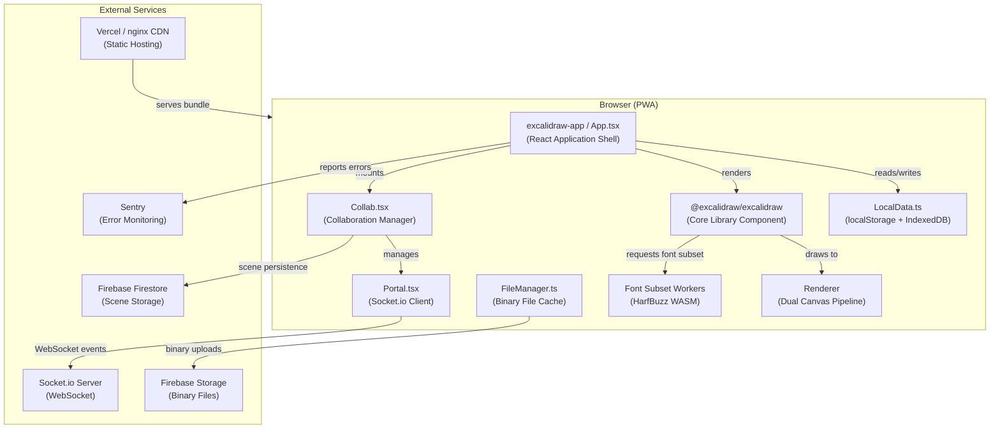
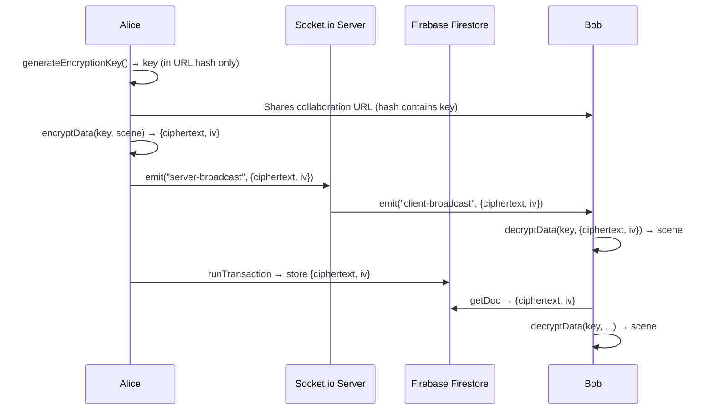
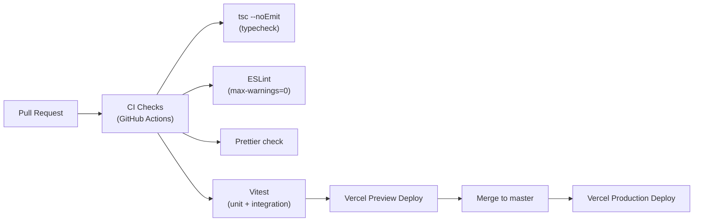
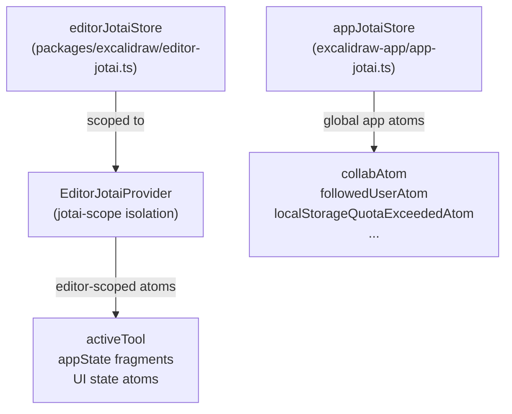
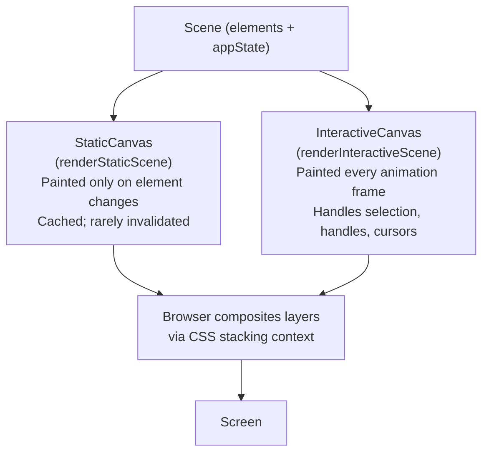
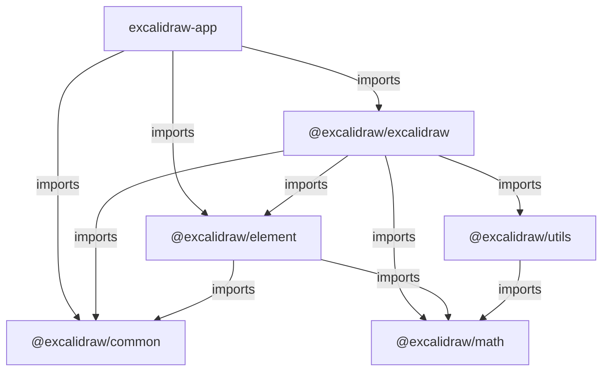
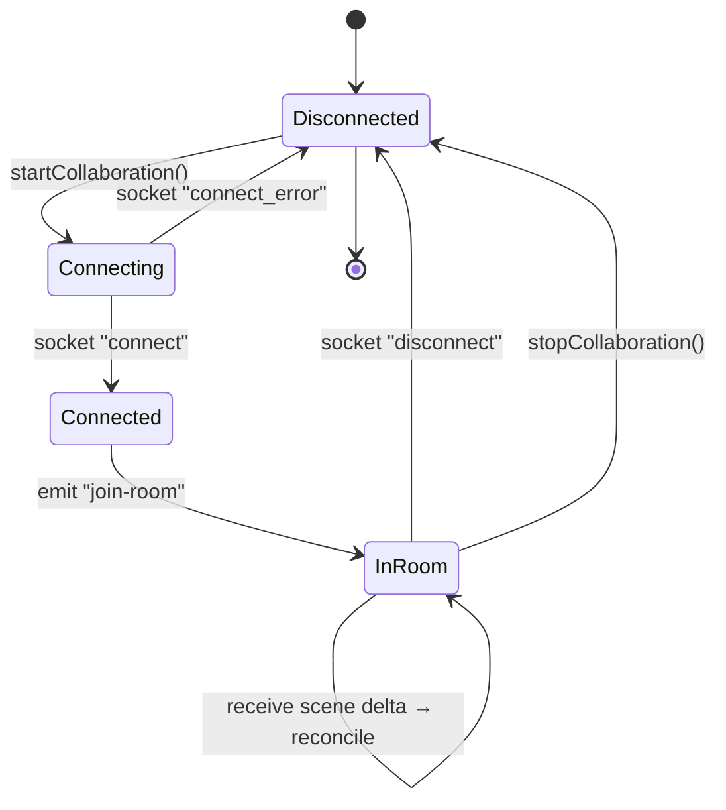

# Excalidraw — Technical Architecture

> **Version:** 0.18.0 · **Audience:** Senior engineers and architects · **Last updated:** 2026-03-28

---

## 1. Architecture Overview

Excalidraw is a **client-rendered, monorepo-based PWA** — all drawing logic runs in the browser; backends are third-party managed platforms.

| Tier              | Technology                   | Responsibility                   |
|-------------------|------------------------------|----------------------------------|
| Web client (SPA)  | React 19, TypeScript, Vite   | Drawing UI, state, rendering     |
| Real-time layer   | Socket.io (WebSocket)        | Live multi-user scene sync       |
| Persistence layer | Firebase Firestore + Storage | Collab room scene & file storage |
| Local persistence | `localStorage` + IndexedDB   | Offline data, library, images    |
| CDN / Hosting     | Vercel / nginx (Docker)      | Static asset delivery            |
| Error monitoring  | Sentry                       | Front-end error capture          |



---

## 2. Core Components

### 2.1 `excalidraw-app` — Application Shell (`excalidraw-app/`)

Deployable web app; not a published package. Wires all subsystems together.

| Sub-module            | File(s)                           | Responsibility                                                                 |
|-----------------------|-----------------------------------|--------------------------------------------------------------------------------|
| App entry point       | `App.tsx`, `index.tsx`            | Root React tree, global providers, URL/hash parsing                            |
| Collaboration manager | `collab/Collab.tsx`               | Owns the collaboration lifecycle, scene reconciliation, user presence          |
| WebSocket transport   | `collab/Portal.tsx`               | Socket.io client wrapper; broadcasts and receives encrypted scene deltas       |
| Local persistence     | `data/LocalData.ts`               | Debounced writes to `localStorage` (appState) and IndexedDB (elements, images) |
| File manager          | `data/FileManager.ts`, `data/firebase.ts` | Binary file upload/status tracking; Firestore CRUD for room scenes   |
| Tab synchronisation   | `data/tabSync.ts`                 | Timestamp-based version vector for cross-tab consistency                       |
| Language detection    | `app-language/`                   | Browser locale detection via `i18next-browser-languagedetector`                |
| Error boundary        | `components/TopErrorBoundary.tsx` | Catches render-phase exceptions; reports to Sentry                             |

**Key deps:** `@excalidraw/excalidraw`, `firebase`, `socket.io-client`, `jotai`, `@sentry/browser`, `idb-keyval`

### 2.2 `@excalidraw/excalidraw` — Core Library (`packages/excalidraw/`)

Publishable NPM package exposing `<Excalidraw>`. All drawing, editing, and UI live here.

| Sub-module      | Path                                                      | Responsibility                                                                       |
|-----------------|-----------------------------------------------------------|--------------------------------------------------------------------------------------|
| Root component  | `components/App.tsx`                                      | Central orchestrator; owns `appState`, dispatches actions, registers event listeners |
| Action manager  | `actions/manager.tsx`                                     | Registry and executor for all discrete user actions (align, delete, flip, etc.)      |
| Scene renderer  | `renderer/staticScene.ts`, `renderer/interactiveScene.ts` | Dual-canvas drawing pipeline                                                         |
| History         | `history.ts`                                              | Undo/redo via `HistoryDelta` applied to `StoreSnapshot`                              |
| Element store   | `@excalidraw/element` → `src/store.ts`                    | Append-only delta store with versioned snapshots (see §2.3)                          |
| Data layer      | `data/`                                                   | JSON import/export, encryption, restore, library, filesystem access                  |
| i18n            | `i18n.ts`, `locales/`                                     | Translation strings + runtime locale switching                                       |
| Fonts           | `fonts/`                                                  | Font face definitions; delegates subsetting to HarfBuzz WASM workers                |
| TTD Dialog      | `components/TTDDialog/`                                   | Text-to-Diagram AI chat + Mermaid preview                                            |
| Command palette | `components/CommandPalette/`                              | Keyboard-driven command search                                                       |
| Sidebar         | `components/Sidebar/`                                     | Plugin-extensible panel system                                                       |

**Peer deps:** `react ^17‖^18‖^19`, `react-dom` (same range)

### 2.3 `@excalidraw/element` — Element Domain (`packages/element/`)

Pure element-domain logic: creation, mutation, bounds, collision, binding, fractional z-indexing, and delta computation. Zero React dependencies.

| Module               | Responsibility                                                     |
|----------------------|--------------------------------------------------------------------|
| `types.ts`           | Canonical TypeScript types for all element shapes                  |
| `store.ts`           | `Store`, `StoreSnapshot`, `StoreDelta` — immutable change tracking |
| `delta.ts`           | Structural diff / patch for element and appState changes           |
| `binding.ts`/`elbowArrow.ts` | Arrow-to-element binding and orthogonal routing               |
| `fractionalIndex.ts` | CRDT-style fractional z-order indices for stable ordering          |
| `Scene.ts`           | In-memory scene container with element map and callbacks           |
| `renderElement.ts`   | Low-level canvas draw calls per element type                       |

### 2.4 `@excalidraw/common` — Shared Utilities (`packages/common/`)

| Module                       | Responsibility                                                          |
|------------------------------|-------------------------------------------------------------------------|
| `appEventBus.ts`             | Typed `Emitter`-based pub/sub bus for cross-component events            |
| `constants.ts`               | App-wide constants (grid size, encryption key bits, theme values, etc.) |
| `utils.ts`                   | General-purpose helpers (debounce, throttle, deep equality, etc.)       |
| `versionedSnapshotStore.ts`  | Generic versioned snapshot container used by the element store          |

### 2.5 Supporting Packages

- **`@excalidraw/math`** (`packages/math/`) — Self-contained 2D geometry library (points, vectors, curves, polygons, ellipses). No external dependencies. Used by arrow routing, collision detection, and snapping.
- **`@excalidraw/utils`** (`packages/utils/`) — Thin helpers for bounding-box computations and shape export; bridges `@excalidraw/math` and consumers.

---

## 3. Data Flow

### 3.1 Local Drawing

```text
User Interaction → ActionManager → Element Store (StoreSnapshot + StoreDelta) → Jotai atom update
  → React re-render → Renderer.updateScene() → StaticCanvas + InteractiveCanvas via requestAnimationFrame
  → Debounced 300 ms write to localStorage (appState) + IndexedDB (elements, images)
```

### 3.2 Collaborative Drawing

```text
Local change → CollabModule.syncScene() → GZIP-compressed (pako) + AES-GCM encrypted
  → Portal.broadcastScene() → Socket.io server → peers decrypt + reconcileElements() → App.updateScene()
  → Full scene persisted to Firestore every 20 s (SYNC_FULL_SCENE_INTERVAL_MS)
```

### 3.3 Binary File (Image) Flow

```text
User pastes image → Blob resized (pica) → stored in IndexedDB immediately
  → FileManager queues uploadBytes() to Firebase Storage → FileStatusStore: pending → saved
```

### 3.4 Key Message Formats

| Channel                 | Format                       | Compression | Encryption            |
|-------------------------|------------------------------|-------------|-----------------------|
| Socket.io scene update  | JSON (`ExcalidrawElement[]`) | pako GZIP   | AES-GCM 128-bit       |
| Socket.io cursor update | JSON (`MouseLocation`)       | None        | AES-GCM 128-bit       |
| Firebase Firestore doc  | Binary `Bytes`               | pako GZIP   | AES-GCM 128-bit       |
| Firebase Storage blob   | Raw bytes (`BinaryFileData`) | None        | None (URL-accessible) |

---

## 4. Communication Patterns

Synchronous drawing logic runs in-process; side effects use async mechanisms:

| Mechanism                | Used For                                                              |
|--------------------------|-----------------------------------------------------------------------|
| Socket.io WebSocket      | Real-time scene delta broadcast, cursor sync, user follow events      |
| Firebase SDK (Firestore) | Async read/write of full scene snapshots on room join / periodic sync |
| Firebase SDK (Storage)   | Async binary file upload / download                                   |
| Web Workers              | Font subsetting (HarfBuzz + woff2 WASM)                               |
| IndexedDB (idb-keyval)   | Async browser storage for images and library data                     |

### Socket.io Protocol Events

| Event (client→server)       | Event (server→client)     | Purpose                         |
|-----------------------------|---------------------------|---------------------------------|
| `join-room`                 | `init-room`, `new-user`   | Room lifecycle                  |
| `server-broadcast`          | `client-broadcast`        | Reliable scene delta delivery   |
| `server-volatile-broadcast` | `client-broadcast`        | Best-effort cursor/idle updates |
| `user-follow`               | `user-follow-room-change` | Follow-mode viewport sync       |
| –                           | `room-user-change`        | Collaborator list updates       |


---

## 5. Data Storage

### `localStorage`

| Key                                  | Contents                              |
|--------------------------------------|---------------------------------------|
| `excalidraw`                         | Serialised `ExcalidrawElement[]` JSON |
| `excalidraw-state`                   | Serialised `AppState` (subset) JSON   |
| `excalidraw-theme`                   | `"light"` \| `"dark"`                 |
| `version-dataState`, `version-files` | Unix timestamp for tab sync           |

### IndexedDB

| Store                  | Contents                           | TTL                            |
|------------------------|------------------------------------|--------------------------------|
| `files-db/files-store` | `BinaryFileData` (images)          | Cleaned after 1 day of non-use |
| `excalidraw-library`   | Library item `ExcalidrawElement[]` | Indefinite                     |
| `excalidraw-ttd-chats` | TTD AI chat history                | Indefinite                     |

### Firebase Firestore

| Collection path  | Document contents                                       | Access                                            |
|------------------|---------------------------------------------------------|---------------------------------------------------|
| `rooms/{roomId}` | `{ sceneVersion, ciphertext: Bytes, iv: Bytes, nonce }` | AES-GCM encrypted; all collaborators hold the key |

### Firebase Storage

| Path prefix                      | Contents                | Max size |
|----------------------------------|-------------------------|----------|
| `/files/shareLinks/{fileId}`     | Share-link binary files | 4 MiB    |
| `/files/rooms/{roomId}/{fileId}` | Collab room image files | 4 MiB    |

---

## 6. Security

### End-to-End Encryption (E2EE)

Collaboration data is encrypted in-browser via **Web Crypto API — AES-GCM 128-bit**. The key lives only in the URL hash fragment (`#roomId=…&key=…`) — never transmitted in HTTP requests. A fresh 12-byte IV is generated per message. Firebase Storage binary files are **not** application-layer encrypted.



### Authentication & Authorization

No auth required; any user with a room URL can join. Excalidraw+ sets `excplus-auth` cookie for premium features. Firebase Security Rules must be configured by operators.

### Input Sanitisation & Content Security

- Element `link` URLs sanitised via `@braintree/sanitize-url` (prevents `javascript:`/`data:` injection).
- Embedded iframe `src` validated against an allow-list; cross-origin embeds sandboxed.
- SVG export strips dangerous attributes. Firebase config injected via `VITE_APP_FIREBASE_CONFIG`; no secrets hard-coded.

---

## 7. Observability

### Sentry (`@sentry/browser` v9)

| Configuration         | Value                                                                           |
|-----------------------|---------------------------------------------------------------------------------|
| Environment detection | Hostname match against `excalidraw.com`, `staging.excalidraw.com`, `vercel.app` |
| Disabled in           | Docker builds (`VITE_APP_DISABLE_SENTRY=true`), local dev                       |
| Release tracking      | `VITE_APP_GIT_SHA` (set by Vercel CI)                                           |
| Console capture       | `console.error` captured via `captureConsoleIntegration`                        |
| URL sanitisation      | Hash fragments stripped in `beforeSend` to avoid leaking encryption keys        |

### Analytics & Logging

`trackEvent()` wraps a configurable backend (disabled by default; `VITE_APP_ENABLE_TRACKING=true` in production). No Prometheus/OpenTelemetry layer; `performance.mark()` / `measure()` used for local profiling. `CustomStats.tsx` renders live canvas statistics as a debug overlay.

---

## 8. Deployment & Infrastructure

### Production (excalidraw.com)

| Concern          | Solution                                                                         |
|------------------|----------------------------------------------------------------------------------|
| Hosting          | **Vercel** — auto-deploys from `master`; preview deploys on PRs                  |
| Build command    | `yarn build:app` → Vite build into `excalidraw-app/build/`                       |
| Env vars         | `VITE_APP_FIREBASE_CONFIG`, `VITE_APP_GIT_SHA`, `VITE_APP_ENABLE_TRACKING`       |

### Self-Hosted (Docker)

Multi-stage build: Node 18 compiles the Vite production bundle (`yarn build:app:docker`), then nginx:1.27-alpine serves the static output. Port 80 inside the container, mapped to 3000 externally via `docker-compose.yml`. `VITE_APP_DISABLE_SENTRY=true` is set automatically.

### CI/CD Pipeline



Pre-commit hooks (Husky + lint-staged) run ESLint and Prettier on staged files.

---

## 9. Scalability & Availability

**Rendering** — dual-canvas split avoids full repaints on cursor moves; `throttleRAF()` coalesces state changes; WASM font workers auto-terminate after 1 s; Mermaid/CodeMirror/locales lazy-loaded; Service Worker CacheFirst means zero-network repeat visits. **Collaboration** — Firestore uses optimistic transactions; `reconcileElements()` performs CRDT-style merge; cursor updates use `SERVER_VOLATILE` (~30 fps); full scene syncs throttled to every 20 s.

| Failure Scenario                 | Behaviour                                                                  |
|----------------------------------|----------------------------------------------------------------------------|
| Collaboration server unavailable | App continues in local-only mode                                           |
| Firebase Firestore unavailable   | Join/save fails gracefully; in-memory scene unaffected                     |
| localStorage quota exceeded      | Atom surfaces warning; write skipped; scene safe in memory                 |
| Browser offline                  | PWA serves cached shell + assets; local drawing continues; collab disabled |

---

## 10. State Management

### Jotai Atoms + Imperative Store

Excalidraw uses a **hybrid** model: **Jotai** (v2 + `jotai-scope`) for reactive UI atoms and an **imperative element store** (`@excalidraw/element → src/store.ts`) for canonical drawing data (see §2.3) — separating high-frequency mutation from lower-frequency UI state.



`editorJotaiStore` uses `jotai-scope` isolation so multiple `<Excalidraw>` instances don't share atoms. `appJotaiStore` is global for the app shell.

### Element State, History & Persistence

Elements are stored as an immutable `SceneElementsMap`. A `StoreSnapshot` + `StoreDelta` is produced on every change — the unit for both history and collab sync. Undo/redo applies `HistoryDelta`; `version`/`versionNonce` excluded to avoid CRDT conflicts. `tabSync.ts` bumps timestamps on writes; other tabs reload when they detect a newer version.

| State            | Persistence mechanism  | Write timing                       |
|------------------|------------------------|------------------------------------|
| Elements         | IndexedDB (idb-keyval) | Debounced 300 ms after last change |
| AppState (UI)    | localStorage           | Debounced 300 ms after last change |
| Library          | IndexedDB              | On library mutation                |
| Theme / Collab username | localStorage   | On change / toggle                 |

---

## 11. Rendering Pipeline

### Dual-Canvas Architecture



**`StaticCanvas`** renders element appearances (shapes, text, images); only invalidated when elements change. **`InteractiveCanvas`** renders transient state (selection boxes, handles, cursors), repainted every frame. **`NewElementCanvas`** previews elements during active creation.

### Render Flow

```text
elements change → Renderer.updateScene() → throttleRAF → renderFrame()
  ├── renderStaticScene → renderElement() per element → roughjs paths + canvas draw calls
  └── renderInteractiveScene → selection boxes, handles, snapping indicators, cursors
```

### Element Rendering

| Element type                | Renderer                                                           |
|-----------------------------|--------------------------------------------------------------------|
| Rectangle, ellipse, diamond | `roughjs` stroke/fill paths                                        |
| Free-draw                   | `perfect-freehand` smooth Bézier paths                             |
| Line / arrow                | `roughjs` paths + arrowhead geometry from `@excalidraw/math`       |
| Text                        | Canvas `fillText()` with font subsetting                           |
| Image                       | `drawImage()` with crop mask                                       |
| Embeddable / iframe         | Off-canvas `<iframe>` positioned via CSS; canvas shows placeholder |

---

## 12. Package Dependencies

### `excalidraw-app` Runtime Dependencies

| Package                            | Version | Purpose                                                |
|------------------------------------|---------|--------------------------------------------------------|
| `firebase`                         | 11.3.1  | Firestore (scene persistence) + Storage (binary files) |
| `socket.io-client`                 | 4.7.2   | WebSocket transport for real-time collaboration        |
| `jotai`                            | 2.11.0  | Reactive atom state management                         |
| `idb-keyval`                       | 6.0.3   | IndexedDB key-value storage                            |
| `@sentry/browser`                  | 9.0.1   | Error capture + source-map de-obfuscation              |
| `react` / `react-dom`              | 19.0.0  | UI framework                                           |
| `i18next-browser-languagedetector` | 6.1.4   | Detect browser locale for i18n                         |

### `@excalidraw/excalidraw` Runtime Dependencies

| Package                               | Version        | Purpose                                    |
|---------------------------------------|----------------|--------------------------------------------|
| `roughjs`                             | 4.6.4          | Hand-drawn shape rendering                 |
| `perfect-freehand`                    | 1.2.0          | Smooth free-draw stroke rendering          |
| `jotai` + `jotai-scope`               | 2.11.0 / 0.7.2 | Scoped atom state                          |
| `pako`                                | 2.0.3          | GZIP compression of scene JSON             |
| `nanoid`                              | 3.3.3          | ID generation for elements                 |
| `browser-fs-access`                   | 0.38.0         | Native File System Access API              |
| `fractional-indexing`                 | 3.2.0          | CRDT z-order indices                       |
| `@braintree/sanitize-url`             | 6.0.2          | URL sanitisation                           |
| `radix-ui`                            | 1.4.3          | Accessible UI primitives                   |

**Versioning:** Exact versions in `excalidraw-app`; semver for `@excalidraw/*`. `yarn.lock` committed; `--frozen-lockfile` in CI. React peer range: `^17.0.2 || ^18.2.0 || ^19.0.0`.

---

## 13. Key Design Decisions

**Client-First, Zero-Server** — All drawing logic runs in the browser with no bespoke application server. Users own their data; the app works offline as a PWA. Trade-off: no server-side search, no cross-device sync outside a collab session.

**End-to-End Encryption** — Collab data is AES-GCM encrypted before leaving the browser; the key lives only in the URL hash fragment and is never seen by Firebase or the Socket.io server. Trade-off: key loss means permanent, unrecoverable data loss.

**Dual-Canvas Rendering** — Static element rendering and interactive UI rendering use separate layered canvas elements. The static canvas is only invalidated when element data changes, enabling smooth 60 fps interactions even with large scenes. Trade-off: increased code complexity.

**Jotai over Redux** — Granular atom subscriptions mean components re-render only when the specific atoms they subscribe to change. `jotai-scope` enables true per-instance isolation for the publishable `<Excalidraw>` component. Trade-off: smaller ecosystem and fewer DevTools integrations than Redux.

**Monorepo with Yarn Workspaces** — Atomic commits across package boundaries, shared tooling, and zero-friction internal package development. Vite aliases resolve internal packages directly from source during dev. Trade-off: Yarn 1 Classic has known hoisting quirks; Docker build requires full monorepo context.

**Firebase over Custom Backend** — Eliminates maintaining a database server; global infrastructure provides low-latency reads/writes. Trade-off: vendor lock-in to Google Firebase (mitigated by `VITE_APP_FIREBASE_CONFIG`).

**roughjs for Hand-Drawn Aesthetics** — Procedurally imperfect paths mimic hand-drawn lines. The `seed` property is stored per-element to ensure consistent rendering across clients (roughjs uses a seeded PRNG).

---

## 14. Future Considerations

- **SSR** — `<Excalidraw>` requires DOM/canvas; SSR would need a renderer interface abstraction.
- **Collab server scaling** — Socket.io server is external; migrating to Liveblocks/Ably/PartyKit would improve scalability.
- **CRDT-native store** — Migrating from `reconcileElements()` + fractional indexing to Yjs/Automerge would eliminate concurrent edit edge cases.
- **WebGPU renderer** — Canvas 2D bottlenecks at 10,000+ elements; WebGPU would enable GPU-accelerated instanced rendering.
- **Offline-first sync** — Current "last write wins" model; CRDTs + Background Sync API would provide conflict-free merging.
- **Yarn Berry / pnpm** — Yarn 1 Classic is in maintenance mode; Berry v4 or pnpm would improve install times and hoisting strictness.

---

## Appendix

### A. Package Dependency Graph



### B. Collaboration Protocol State Machine



### C. Key Environment Variables

| Variable                    | Required     | Default     | Purpose                                   |
|-----------------------------|--------------|-------------|-------------------------------------------|
| `VITE_APP_FIREBASE_CONFIG`  | Yes (collab) | `{}`        | JSON Firebase project configuration       |
| `VITE_APP_GIT_SHA`          | No           | `undefined` | Injected by CI; used as Sentry release ID |
| `VITE_APP_ENABLE_TRACKING`  | No           | `false`     | Enables analytics event tracking          |
| `VITE_APP_DISABLE_SENTRY`   | No           | `false`     | Disables Sentry in Docker/local builds    |
| `VITE_APP_ENABLE_PWA`       | No           | `false`     | Enables PWA in development mode           |
