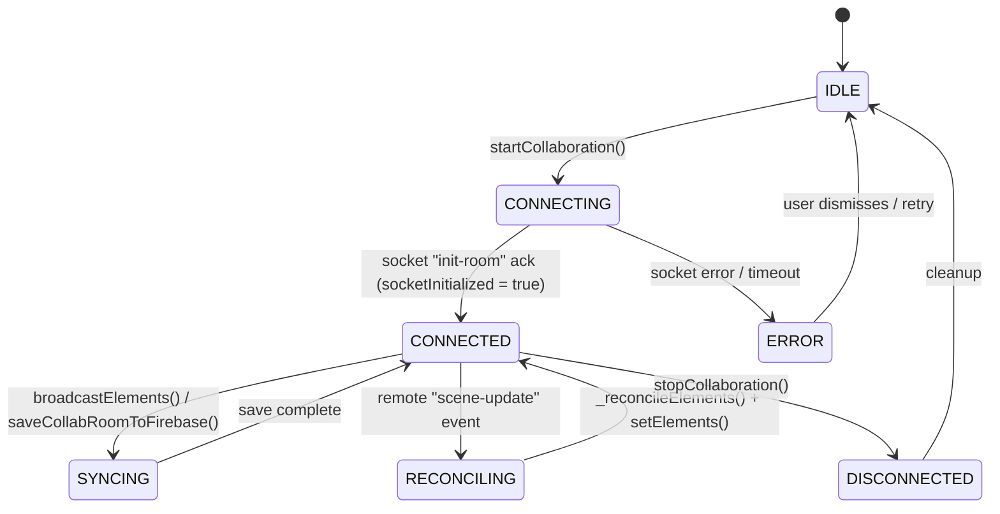
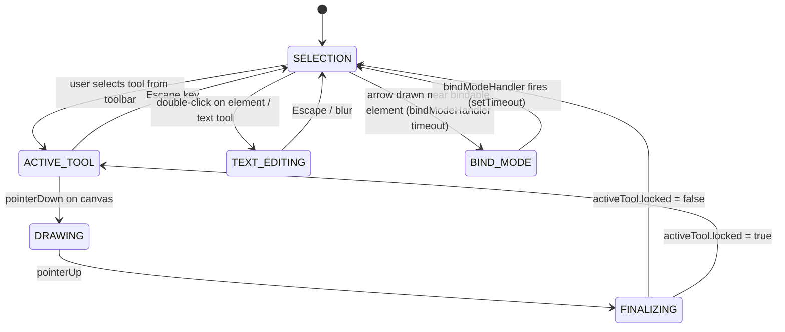
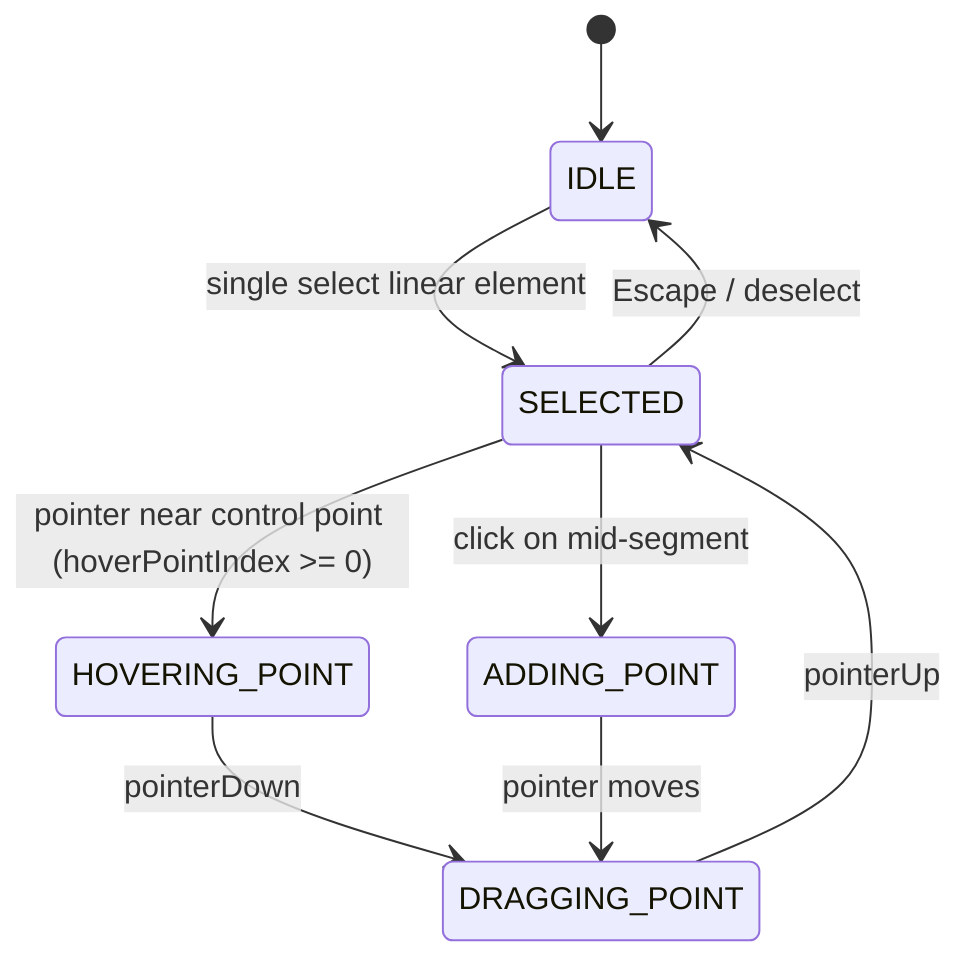
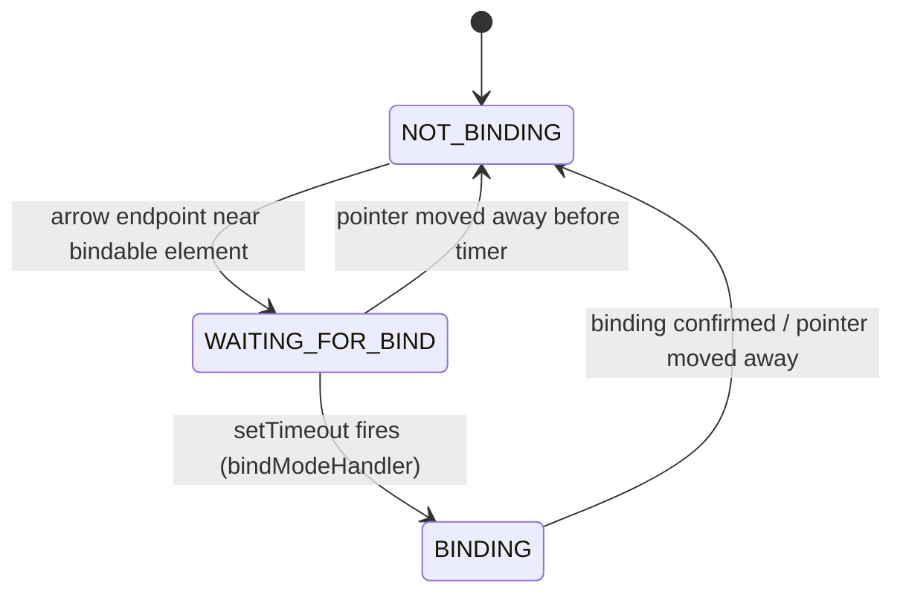

# Technical Debt Catalog

> **Source**: Migrated from `docs/memory/decisionLog.md`
> **Scope**: `excalidraw-app/` and `packages/`
> **Last updated**: 2026-03-29

Full detail for every flagged finding. Cross-reference with `docs/memory/decisionLog.md` for the concise summary.

---

## Table of Contents

1. [Implicit State Machines](#1-implicit-state-machines)
2. [Non-obvious Side Effects](#2-non-obvious-side-effects)
3. [Initialization Order Dependencies](#3-initialization-order-dependencies)
4. [Hidden Assumptions & Constraints](#4-hidden-assumptions--constraints)
5. [Full Annotated Findings Table](#5-full-annotated-findings-table)
6. [High-Risk Issue Clusters](#6-high-risk-issue-clusters)

---

## 1. Implicit State Machines

### 1.1 Collaboration Lifecycle (`excalidraw-app/collab/Collab.tsx`)

State is inferred from Jotai atoms (`isCollaboratingAtom`, `collabErrorIndicatorAtom`) and instance flags (`socketInitialized`, `isSyncing`) — no single explicit state object.

**Key implicit transitions:**
- `CONNECTING → CONNECTED` gated solely on server `"init-room"` message setting `portal.socketInitialized = true` (excalidraw-app/collab/Collab.tsx line 751).
- `restoreElements()` runs **before** reconciliation (line 762) — admitted wrong but required to avoid regenerating `appState.newElement`.
- `LocalData.pauseSave("collaboration")` has no guaranteed symmetric resume on error paths — pause can persist indefinitely if an exception is thrown mid-startup.

---

### 1.2 Active Tool / Drawing State Machine (`packages/excalidraw/components/App.tsx`)

State held in `appState.activeTool` and `appState.preferredSelectionTool`.

**Implicit logic:** `bindModeHandler` is a `ReturnType<typeof setTimeout>` stored as a class instance property. The transition back from `BIND_MODE` is purely time-driven. If two concurrent pointer devices share the same `bindModeHandler` reference (stylus + touch), they can cancel each other's binding.

---

### 1.3 Linear Element Editor State Machine (`packages/element/src/linearElementEditor.ts`)

**Hidden assumption:** `selectedPointsIndices` and `hoverPointIndex` must be kept in sync on every pointer event. If `pointerUp` fires without a matching `pointerDown` (e.g., mobile scroll), `hoverPointIndex` can remain non-negative, causing phantom hover rendering.

---

### 1.4 Bind Mode Timer (`packages/excalidraw/components/App.tsx`)

Timer is reset on every pointer move (debounce pattern, undocumented). Concurrent pointer devices share the same reference, potentially cancelling each other's binding.

---

## 2. Non-obvious Side Effects

### 2.1 Raw `mutateElement()` Bypasses History and Collab Sync

- **File**: `packages/excalidraw/components/App.tsx` (lines 11376, 11386, 11401, 11412)
- **Comment**: `// NOTE: We use the raw mutateElement() because we don't want history entries or multiplayer updates`
- **Behavior**: Directly mutates elements without triggering the Store's capture pipeline — invisible to undo/redo and not propagated to collab peers.
- **Risk**: **Silent state divergence in collab.** After arrow deletion, `boundElements` cleanup on targets is never broadcast. Collaborators retain stale `boundElements` until next full reconciliation.
- **Type**: NOTE → design constraint; architectural issue with the "silent mutation" pattern.

---

### 2.2 `FileManager` Won't Retry Failed Saves

- **File**: `excalidraw-app/data/FileManager.ts` (line 107)
- **Comment**: `// NOTE if errored during save, won't retry due to this check`
- **Behavior**: Once a file is added to `savingFiles`, subsequent save attempts skip it. A network error leaves the file permanently stuck — never moved to "saved", never retried.
- **Risk**: **Permanent data loss for image elements in collab sessions.** Images embedded after a transient network error are never uploaded to Firebase, causing broken image references for all collaborators.
- **Type**: NOTE → silent failure; potential data loss bug.

---

### 2.3 `isSomeElementSelected` Module-Level Memoization Is Not Instance-Safe

- **File**: `packages/element/src/selection.ts` (line 138)
- **Comment**: `// FIXME move this into the editor instance to keep utility methods stateless`
- **Behavior**: Memoization cache is shared across all `<Excalidraw>` instances in the same JS module scope. Two mounted instances clobber each other's cached selection state.
- **Risk**: **Incorrect selection in multi-instance deployments.** Manifests as "ghost selections" or toggles across unrelated canvases.
- **Type**: FIXME → global state that should be instance-scoped.

---

### 2.4 `restoreElements` Runs Before Reconciliation in Collab

- **File**: `excalidraw-app/collab/Collab.tsx` (line 762)
- **Comment**: `// NOTE ideally we restore _after_ reconciliation but we can't do that as we'd regenerate even elements such as appState.newElement which would break the state`
- **Behavior**: Remote elements are restored (IDs normalized, missing fields populated) before conflict resolution. Under concurrent drawing, remote restore can regenerate the in-progress element with default values.
- **Risk**: **Drawing corruption under concurrent collab.** If a remote scene update arrives mid-draw, the `newElement` in `appState` can be replaced with a restored default, dropping the in-progress shape.
- **Type**: NOTE → ordering constraint with known trade-off.

---

### 2.5 Deletion During Restore Doesn't Record to Store

- **File**: `packages/excalidraw/data/restore.ts` (line 408)
- **Comment**: `// TODO: we should not do this since it breaks sync / versioning when we exchange / apply just deltas`
- **Behavior**: Elements with truncated text are silently deleted during restore (`isDeleted: true`, `bumpVersion`). Not captured by Store → no delta, no undo history, not broadcast to peers.
- **Risk**: **Deleted elements reappear for collaborators.** Peers receiving delta-only sync will see elements the local client deleted but never broadcast.
- **Type**: TODO → known design violation; breaks delta sync. Part of issue cluster #7348.

---

### 2.6 `LocalData.pauseSave` May Not Be Resumed on Error

- **File**: `excalidraw-app/collab/Collab.tsx` (line 499)
- **Comment**: `// TODO: 'ImportedDataState' type here seems abused`
- **Behavior**: `LocalData.pauseSave` is called before an async socket import. If the dynamic import fails, `pauseSave` remains active indefinitely; `stopCollaboration()` is never called.
- **Risk**: **Loss of auto-save on collaboration startup failure.** User edits made after a failed collab start are never persisted locally.
- **Type**: TODO (type abuse) → latent control-flow bug.

---

## 3. Initialization Order Dependencies

### 3.1 Wheel/Touch Events Must Be Registered Imperatively

- **File**: `packages/excalidraw/components/App.tsx` (line 11754)
- **Comment**: `// NOTE wheel, touchstart, touchend events must be registered outside of react because react binds them passively`
- **Behavior**: `touchstart` and `wheel` are attached via canvas ref callback with `{ passive: false }`. This is the only way to call `preventDefault()` — React 17+ makes all listeners passive.
- **Risk**: If React replaces the canvas node during re-mount (Strict Mode double-invoke), a bug in the cleanup path would leave orphaned listeners firing against a detached DOM node.
- **Type**: NOTE → architecture constraint; correct but fragile.

---

### 3.2 `flushSync` Required for Bind Mode State Visibility

- **File**: `packages/excalidraw/components/App.tsx` (line 9216)
- **Comment**: `// NOTE: We need the flushSync here for the delayed bind mode change to see the right state (specifically the newElement)`
- **Behavior**: `flushSync` forces synchronous React state flush so the `bindModeHandler` setTimeout sees the correct `this.state.newElement`.
- **Risk**: **React 18 Concurrent Mode incompatibility.** `flushSync` suppresses concurrent features for the wrapped update. Cannot be replaced by a transition without rethinking the bind mode timer architecture.
- **Type**: NOTE → timing dependency; coupled to React rendering model.

---

### 3.3 `Scene.getScene()` Static Accessor Workaround

- **File**: `packages/element/src/elbowArrow.ts` (lines 995, 1059)
- **Comment**: `// TODO (dwelle,mtolmacs): Remove this once Scene.getScene() is removed`
- **Behavior**: When `elementsMap.size === 0`, function short-circuits to normalization-only path — conflating "no scene context" with "empty scene". A legitimate empty scene skips binding resolution.
- **Risk**: **Wrong routing for empty scenes.** Arrow binding silently dropped on just-cleared scenes.
- **Type**: TODO → architectural workaround; depends on removal of global singleton.

---

### 3.4 Library Migration Adapter Active Since 2024-03-11

- **File**: `excalidraw-app/App.tsx` (line 417)
- **Comment**: `// TODO maybe remove this in several months (shipped: 24-03-11)`
- **Behavior**: Every startup runs `LibraryLocalStorageMigrationAdapter` to migrate library data from `localStorage` to IndexedDB. After migration it's a no-op but still runs detection logic on every load.
- **Risk**: **Ongoing startup overhead.** Regression in the adapter could corrupt user libraries on upgrade. Running for over a year without removal.
- **Type**: TODO → time-bounded workaround, deadline long past.

---

## 4. Hidden Assumptions & Constraints

### 4.1 Hit-Test Threshold Has Hardcoded FP Precision Floor

- **File**: `packages/excalidraw/components/App.tsx` (line 6043)
- **Comment**: `// NOTE: Here be dragons. Do not go under the 0.63 multiplier...`
- **Behavior**: Hit threshold uses `Math.max(strokeWidth/2 + 0.1, 0.85 * DEFAULT_COLLISION_THRESHOLD / zoom)`. Current multiplier is 0.85 (was 0.63); constraint remains: below a certain value, FP arithmetic in collision detection produces false negatives.
- **Risk**: Changing `DEFAULT_COLLISION_THRESHOLD` or adding DPR scaling could silently push the effective threshold below the safe floor, causing unclickable elements at high zoom.
- **Type**: NOTE → magic constant with undocumented origin.

---

### 4.2 `positionElementsOnGrid` Is Admitted Vibe-Coded

- **File**: `packages/element/src/positionElementsOnGrid.ts` (line 6)
- **Comment**: `// TODO rewrite (mostly vibe-coded)`
- **Behavior**: Grid layout uses `Math.ceil(Math.sqrt(N))` columns with no regard for aspect ratios, element sizes, or canvas space. Mixed large/small elements produce overlapping or misaligned placements.
- **Risk**: **AI-generated element positioning incorrect for heterogeneous scenes.** Users manually reposition after every AI generation.
- **Type**: TODO → acknowledged low-quality implementation.

---

### 4.3 `isElementInFrame` Is O(n) and Identified as Bottleneck

- **File**: `packages/element/src/frame.ts` (line 752)
- **Comment**: `// TODO: this a huge bottleneck for large scenes, optimise`
- **Behavior**: Called every render to determine frame membership. Traverses group hierarchies and element maps on every call with no caching or dirty-flag mechanism.
- **Risk**: **Render jank in large scenes.** 500+ elements with frames experience increasing frame drop during drag operations.
- **Type**: TODO → known performance bottleneck, no mitigation in place.

---

### 4.4 Snapping Gap Limit Is Arbitrarily Large

- **File**: `packages/excalidraw/snapping.ts` (line 44)
- **Comment**: `// TODO increase or remove once we optimize`
- **Behavior**: `VISIBLE_GAPS_LIMIT_PER_AXIS = 99999` — a safety valve against O(n²) blowup. When hit, snapping silently stops computing additional candidates.
- **Risk**: **Silent snapping degradation.** No UI indication when limit is hit; user just gets fewer snap points.
- **Type**: TODO → placeholder limit with no measurement-backed value.

---

### 4.5 Elbow Arrow Normalization Overflow Guard Is Temporary (5 Files)

- **Files**: `packages/element/src/elbowArrow.ts:2119`, `packages/element/src/newElement.ts:103`, `packages/element/src/shape.ts:899`, `packages/excalidraw/data/restore.ts:765`, `packages/utils/src/shape.ts:198`
- **Comment**: `// NOTE (mtolmacs): This is a temporary check...should be removed once we have an answer`
- **Behavior**: Five independent overflow guards for element positions/sizes exceeding 1e6 units. Guards skip rendering, log errors, or reset arrow points.
- **Risk**: **Elbow arrows silently disappear.** Users see vanishing arrows with no error UI. `console.error` is the only signal.
- **Type**: NOTE (TEMPORARY) → active bug under investigation; root cause in `updateElbowArrowPoints` / `generateElbowArrowShape`.

---

### 4.6 Delta Comparison Logic Suspected Wrong

- **File**: `packages/element/src/delta.ts` (lines 842, 853)
- **Comment**: `// TODO: this seems wrong, we are already doing this comparison generically above`
- **Behavior**: `filterInvisibleChanges` comparisons for `lockedMultiSelections` and `activeLockedId` may be redundant with a prior generic comparison, recording visually identical state changes as separate undo entries.
- **Risk**: **Phantom undo entries.** Ctrl+Z steps appear to do nothing, eroding trust in the undo stack.
- **Type**: TODO → suspected correctness bug in history filtering.

---

### 4.7 `StoreChange` Excludes Binary Files

- **File**: `packages/element/src/store.ts` (line 434)
- **Comment**: `// TODO: we might need to have binary files here as well, in order to be drop-in replacement for onChange`
- **Behavior**: `StoreChange` tracks elements and appState only — not binary file changes (images, fonts). Not a drop-in replacement for the raw `onChange` API.
- **Risk**: **Missed file change events for `StoreChange` consumers.** Plugins/integrations using store increments miss image upload/removal events.
- **Type**: TODO → incomplete abstraction.

---

### 4.8 `textWysiwyg` Theme Updates Rely on `onChangeEmitter` Polling

- **File**: `packages/excalidraw/wysiwyg/textWysiwyg.tsx` (line 964)
- **Comment**: `// FIXME after we start emitting updates from Store for appState.theme`
- **Behavior**: WYSIWYG editor polls `app.state.theme` on every element change via `onChangeEmitter`. Theme changes not emitted as discrete Store events — fires thousands of times per session.
- **Risk**: **Performance regression in text-heavy sessions.** Theme changed externally (no element mutation) deferred until next element change, causing a brief visual flash.
- **Type**: FIXME → workaround for missing Store event.

---

### 4.9 `UIOptions` Normalization Missing in Parent Component

- **File**: `packages/excalidraw/index.tsx` (line 105)
- **Comment**: `// FIXME normalize/set defaults in parent component so that the memo resolver compares the same values`
- **Behavior**: `UIOptions` rebuilt from `props.UIOptions` on every render — always a new reference, defeating all `React.memo`/`useMemo` on children that depend on it.
- **Risk**: **Unnecessary re-renders on every parent render.** Affects toolbar, panels, and memoized children. High overhead in collab/animation scenarios.
- **Type**: FIXME → performance issue from incorrect memoization boundary.

---

### 4.10 `colors.ts` Has Circular Dependency Workaround

- **File**: `packages/common/src/colors.ts` (line 116)
- **Comment**: `// FIXME can't put to utils.ts rn because of circular dependency`
- **Behavior**: Generic `pick` utility defined inline in `colors.ts` because moving it to `utils.ts` creates a circular import cycle.
- **Risk**: **Unpredictable module initialization order** in environments where circular dependencies cause incomplete exports. New imports to `utils.ts` could trigger circular dependency failures at runtime.
- **Type**: FIXME → module architecture issue.

---

## 5. Full Annotated Findings Table

| File | Line | Type | Brief Description | Risk |
|------|------|------|-------------------|------|
| `excalidraw-app/App.tsx` | 417 | TODO | Library migration adapter still active since 2024-03-11 | Medium |
| `excalidraw-app/collab/Collab.tsx` | 499 | TODO | `ImportedDataState` type abused; latent pause/resume bug | High |
| `excalidraw-app/collab/Collab.tsx` | 762 | NOTE | `restoreElements` before reconciliation — known ordering violation | High |
| `excalidraw-app/data/FileManager.ts` | 107 | NOTE | Failed saves never retried → silent data loss | High |
| `packages/common/src/colors.ts` | 116 | FIXME | `pick` utility trapped by circular dependency | Low |
| `packages/common/src/constants.ts` | 123 | TODO | Font ID should be a hash, not an integer | Low |
| `packages/common/src/points.ts` | 67 | TODO | Free drawing shake due to rounding | Medium |
| `packages/element/src/Scene.ts` | 179 | NOTE | `selectedElementIds` optional due to missing App coupling | Low |
| `packages/element/src/delta.ts` | 726 | TODO | Empty undo/redo entries from deleted element references | Medium |
| `packages/element/src/delta.ts` | 842, 853 | TODO | Wrong/redundant comparison in `filterInvisibleChanges` | Medium |
| `packages/element/src/delta.ts` | 1422 | TODO | No semantic/syntactic validation before applying element deltas | High |
| `packages/element/src/delta.ts` | 1738 | TODO | Bound arrows sometimes redrawn incorrectly | Medium |
| `packages/element/src/delta.ts` | 1882 | TODO | Missing `startBinding`/`endBinding` in `BoundElement` context | Medium |
| `packages/element/src/delta.ts` | 1970 | TODO | Precise binding check is expensive; no optimization | Medium |
| `packages/element/src/elbowArrow.ts` | 995, 1059 | TODO | `Scene.getScene()` singleton workaround | Medium |
| `packages/element/src/elbowArrow.ts` | 2119 | NOTE | Temporary overflow check for normalization bug | High |
| `packages/element/src/frame.ts` | 752 | TODO | `isElementInFrame` O(n) bottleneck | High |
| `packages/element/src/frame.ts` | 912 | TODO | Frame naming logic applies to all frames, not just AI frames | Low |
| `packages/element/src/newElement.ts` | 103 | NOTE | Temporary large position/size guard | Medium |
| `packages/element/src/positionElementsOnGrid.ts` | 6 | TODO | Vibe-coded grid layout | Medium |
| `packages/element/src/selection.ts` | 138 | FIXME | Module-level memoization breaks multi-instance | High |
| `packages/element/src/shape.ts` | 899 | NOTE | Temporary guard for oversized elbow arrow shapes | High |
| `packages/element/src/sizeHelpers.ts` | 27 | TODO | Invisible elements leak into store / export / collab | High |
| `packages/element/src/store.ts` | 109 | TODO | `scheduleCapture()` called too broadly; error-prone | Medium |
| `packages/element/src/store.ts` | 434 | TODO | `StoreChange` missing binary files | Medium |
| `packages/element/src/store.ts` | 980, 981 | TODO | Deep clone strategy in snapshots unresolved | Low |
| `packages/element/src/textMeasurements.ts` | 31, 98 | FIXME | Misleadingly named exported functions | Low |
| `packages/element/src/typeChecks.ts` | 212 | TODO | Distance calculation approximation in type checking | Low |
| `packages/excalidraw/actions/actionAlign.tsx` | 50 | TODO | Frame alignment disabled silently | Low |
| `packages/excalidraw/actions/actionDistribute.tsx` | 43 | TODO | Frame distribution disabled silently | Low |
| `packages/excalidraw/actions/actionFinalize.tsx` | 142, 232 | TODO | Invisible elements recorded by store; restoreable via undo | High |
| `packages/excalidraw/actions/actionFinalize.tsx` | 346 | TODO | Over-captures on finalize causing inconsistencies | Medium |
| `packages/excalidraw/components/App.tsx` | 689 | TODO/HACK | Touch/pointer event unification incomplete | Medium |
| `packages/excalidraw/components/App.tsx` | 6043 | NOTE | Hit-test FP threshold magic constant 0.85 | Medium |
| `packages/excalidraw/components/App.tsx` | 7126 | HACK | Mobile linear element transform handles disabled | Low |
| `packages/excalidraw/components/App.tsx` | 8758 | FIXME | Bare FIXME — text binding container resolution | Medium |
| `packages/excalidraw/components/App.tsx` | 9216 | NOTE | `flushSync` timing dependency for bind mode | High |
| `packages/excalidraw/components/App.tsx` | 10007 | NOTE | Hacky `frameId` reset during duplicate | Low |
| `packages/excalidraw/components/App.tsx` | 11376–11412 | NOTE | Raw `mutateElement` bypasses history/collab | High |
| `packages/excalidraw/components/App.tsx` | 11754 | NOTE | Imperative event registration required for touch/wheel | Medium |
| `packages/excalidraw/components/EyeDropper.tsx` | 105 | FIXME | Eye dropper preview not repositioned at viewport edge | Low |
| `packages/excalidraw/data/library.ts` | 253 | TODO | Library jotai store not scoped per Excalidraw instance | Medium |
| `packages/excalidraw/data/restore.ts` | 408 | TODO | Silent deletion during restore breaks delta sync | High |
| `packages/excalidraw/data/restore.ts` | 502 | TODO | Arrow and linear element types not separated | Low |
| `packages/excalidraw/data/restore.ts` | 765 | NOTE | Temporary fix for large unbound elbow arrows | High |
| `packages/excalidraw/fonts/Fonts.ts` | 339 | TODO | Font ID number type blocks custom font support | Medium |
| `packages/excalidraw/index.tsx` | 105 | FIXME | `UIOptions` rebuilt each render — breaks memoization | Medium |
| `packages/excalidraw/snapping.ts` | 44 | TODO | Snap gap limit is arbitrary; degrades silently | Low |
| `packages/excalidraw/wysiwyg/textWysiwyg.tsx` | 964 | FIXME | Theme polling in `onChangeEmitter` instead of Store event | Medium |
| `packages/math/src/point.ts` | 26, 30 | TODO | Point type migration in progress; dual overloads | Low |
| `packages/utils/src/shape.ts` | 198 | NOTE | Temporary guard for null `Drawable` in shape ops | Medium |
| `packages/utils/src/shape.ts` | 361 | TODO | Rounded rectangle implementation is placeholder | Low |

---

## 6. High-Risk Issue Clusters

### Cluster A: Elbow Arrow Overflow (5 files)

The same root cause — unbounded coordinate generation in the normalization algorithm — is independently guarded in:
- `packages/element/src/newElement.ts:103`
- `packages/element/src/elbowArrow.ts:2119`
- `packages/element/src/shape.ts:899`
- `packages/excalidraw/data/restore.ts:765`
- `packages/utils/src/shape.ts:198`

**Recommended action**: Fix the root cause in `updateElbowArrowPoints` / `generateElbowArrowShape`, then remove all five guards together.

---

### Cluster B: Delta/Store Integrity — Issue #7348 (6 locations)

Issues tagged `// TODO: #7348` represent a known gap in the undo/redo + collab delta system:
- `delta.ts:726` — empty undo entries from deleted element references
- `delta.ts:1422` — missing semantic validation before applying deltas
- `delta.ts:1882` — missing arrow rebind context
- `actionFinalize.tsx:142, 232` — invisible elements recorded by store
- `restore.ts:408` — silent deletion during restore not recorded

**Recommended action**: Address together as part of issue #7348; fixing one in isolation may shift the bug to another location.

---

### Cluster C: Multi-Instance Isolation (3 locations)

Three issues break `<Excalidraw>` multi-instance correctness:
- `selection.ts:138` — module-level selection cache shared across instances
- `data/library.ts:253` — Jotai store not scoped per instance
- `index.tsx:105` — `UIOptions` memo defeats memoization

**Recommended action**: Audit all module-level caches and singletons against the multi-instance embedding use case.

---

## 7. Performance Bottlenecks

| Issue | Detail |
|---|---|
| **Large-canvas rendering** | Scene rendering can degrade noticeably for very large diagrams (hundreds of elements). The canvas rendering pipeline and virtual viewport clipping are actively being optimised, but there is no current hard limit on element count. Target is P95 render time < 16 ms for ≤ 500 elements. |
| **Main-thread blocking** | All heavy computation (reconciliation, AES-GCM encryption, Mermaid-to-Excalidraw conversion) runs on the main browser thread. Web Worker offloading is planned but not yet implemented. |
| **Mobile / touch UX** | The product is desktop-first. Touch and pen input are supported via Pointer Events and the PEP polyfill, but the mobile experience lags behind desktop in ergonomics and performance. |

---

## 8. Tech Debt & Deprecated Components

| Item | Detail |
|---|---|
| **Firebase vendor coupling** | Cloud persistence is tightly coupled to Firebase Firestore and Storage. An abstraction layer exists (`excalidraw-app/data/firebase.ts`) but migrating to an alternative backend (S3, Supabase, self-hosted) would require significant effort. |
| **Build-time feature flags** | Feature flags are `VITE_APP_ENABLE_*` environment variables baked in at build time. Changing a flag requires a full rebuild and redeployment. Runtime feature flag management is not implemented. |
| **LWW conflict reconciliation** | The Last-Write-Wins algorithm with nonce tiebreaking is not a full CRDT. Occasional brief inconsistencies during concurrent edits are possible. The 20-second full-scene sync mitigates but does not eliminate this. |
| **No e2e test coverage** | There are no Playwright or Cypress end-to-end tests. Coverage is provided by Vitest integration tests with React Testing Library (which renders the full component in jsdom). Real-browser testing is not automated. |
| **TTD reliability** | AI-generated Mermaid output frequently contains syntax errors. The `mermaidAutoFix` utility repairs common issues but does not cover all failure modes, leading to occasional failed renders. |
| **Monorepo build complexity** | The `common → math → element → excalidraw` dependency chain requires strict build ordering. Changes to lower-level packages require rebuilding all dependents. This adds overhead for contributors. |

---

## Related Documentation

| Document | Location | Relationship |
|---|---|---|
| **Decision Log (Summary)** | [`docs/memory/decisionLog.md`](../memory/decisionLog.md) | Concise summary of key decisions and high-risk findings |
| **Technical Architecture** | [`docs/technical/architecture.md`](architecture.md) | Authoritative system design; many findings are rooted in trade-offs documented there |
| **Product Requirements** | [`docs/product/PRD.md`](../product/PRD.md) | Product constraints on how debt may be resolved (API stability, etc.) |
